<div align="center">

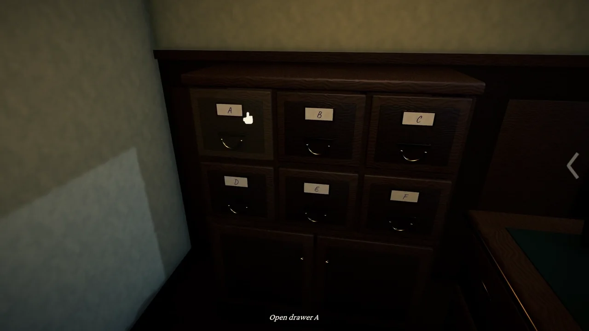

# Lost & Found

**Run the lost-property desk at a 1962 railway station, where some belongings should never be returned.**


</div>

## Play in your browser

**[Play Lost & Found in your browser →](https://nearbycoder.github.io/LostAndFound/)** (GitHub Pages, built from today's `main`)

- **Browsers:** a desktop browser with WebGL 2 and hardware acceleration on. Checked in headless Chromium (Chrome for Testing 151) and headless Firefox 157 on Linux; not yet tried in Safari, on Windows or macOS, or by a person at a real window.
- **Download:** about 69 MB the first time (the browser keeps it, so a second visit starts sooner). On this machine the title came up 7–10 s after the page was asked for, from a local server under load; over the internet it depends on your connection.
- **What's different from the desktop game:** it starts at *Graphics fidelity: Medium* (Settings has all four steps); the save and settings live in this browser's storage for the site, separate from a desktop save, and clearing the site's data erases them; sound starts with your first click or key; *Fullscreen* is the browser's (Esc leaves it, so press Esc again to pause); there's no *Close the Office* or *Sound when in the background*. Mouse, keyboard and a gamepad work as on the desktop (the gamepad through the browser, untried on a real controller); there's no touch support, and phones and tablets get a warning before the download.
- In headless Firefox the depth-of-field blur didn't run (its shaders were reported unsupported there); Chromium draws it.

## Trailer

[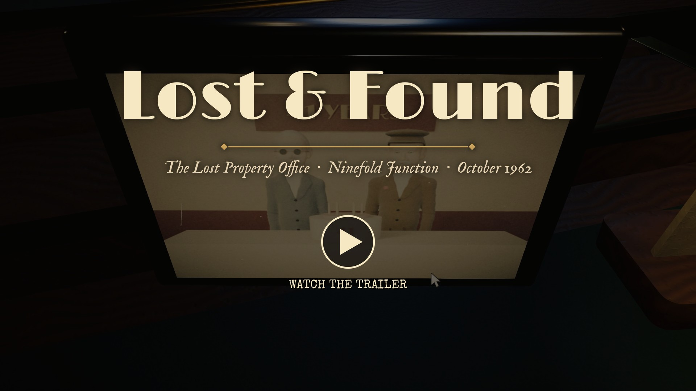](docs/media/trailer.mp4)

*Click the frame to watch the trailer: 1080p MP4 with the game's own music and sound, 2 minutes 10 seconds. Every shot is the real game, played through a simulated mouse and keyboard at* Graphics fidelity: Ultra *(the captions and title cards are laid over it), recorded on 8 October 2026 from today's `main` (with the recorder's capture-only showcase, build `97f9974`). The trailer attached to the [v0.1.0 release](https://github.com/nearbycoder/LostAndFound/releases/tag/v0.1.0) is the earlier cut from 4 October.*

## About

*Ninefold Junction, October 1962.* You have taken over the Lost Property desk from Agnes Pell, who ran it for forty-one years. Commuters come to the window to claim what they've lost. You search the drawers and the shelf, turn each object over in your hands, find what's hidden in it, and stamp the claim: **RETURN**, **REFUSE**, or **SEAL** it in the Iron Drawer.

Some people are lying. Some things hum when their owner is near. Some things come from tomorrow. And some belongings should never be returned at all, especially not to the polite grey gentleman who keeps asking for the keys.

It's a small deduction game about **looking closely**. There are no timers and no walls of text: every case can be solved from what's on the desk, which is the intake tag, the object's hidden details, the claimant's story, and Agnes's rules. The good moment is finding the one detail that breaks a story, or proves it.

- **One desk, 25 objects, a five-day story, three endings.** A full week takes about an hour.
- **Tactile.** Drawers slide and rattle, objects turn in your hands, latches click, stamps thump, and the ticket printer chatters out a receipt.
- **25 distinct characters**, each sculpted in Blender, with their own voice, silhouette and habits.
- **Help when you want it, never when you don't**: Agnes's nudges, her rules on the desk, every word of the claim beside the slip, and the week's ledger at hand.
- **Everything is generated from code in this repository**: every model is a Blender script, every texture and photograph is processed in Python, and every sound and piece of music is synthesised.

> **Which version is this?** This README, the trailer and the screenshots show the current `main`. The only download, **v0.1.0 (4 October 2026)**, was built before the twelve rounds of improvements since ([docs/IMPROVEMENTS.md](docs/IMPROVEMENTS.md)), so it has none of: Agnes's nudges, the rules card, the transcript beside the slip, the stamp hint, the ledger book, Curiosities, *Graphics fidelity*, menus by keyboard or pad, gamepad play, *Large text*, *Plain lettering*, *Brightness*, the fairness fixes to two cases, or the crash-safe save. To play today's game, [build it from source](#build-from-source).

## Features

### Search the desk

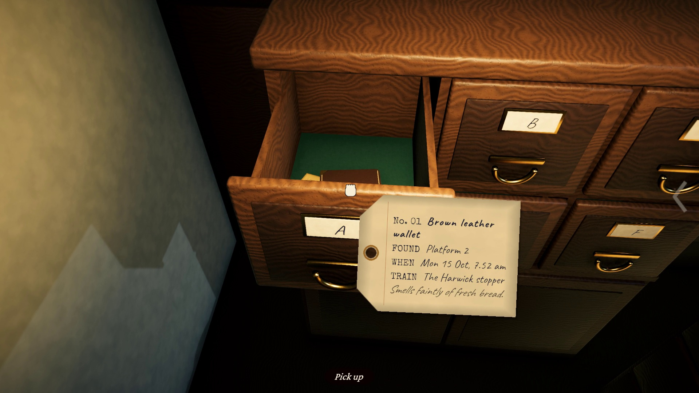 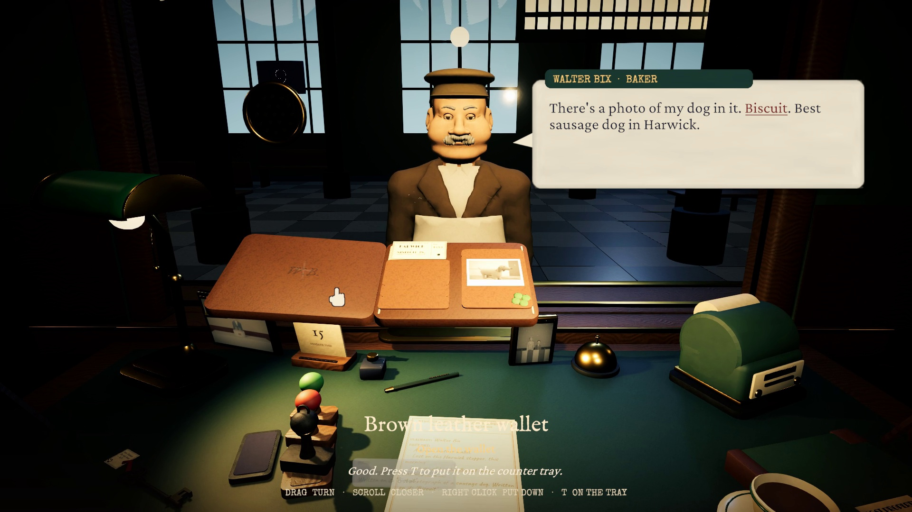

Six drawers, three shelves, an umbrella stand and the Iron Drawer. Every stray has a manila **intake tag** that says where it was found, when and on which train, and the porter's notes. Pick the object up and it comes to your hands under the lamp. Drag to turn it, scroll to lean in, and open its lid, latch or clasp. A magnifier glints when you're near a **hidden detail**, such as a name strip inside an umbrella, a photo of a dachshund called Biscuit, or a date stamped on the back of a photograph. Each discovery is written onto the claim slip, and the object's name in your hands shows how many of its findings you've noted.

### Catch the liars

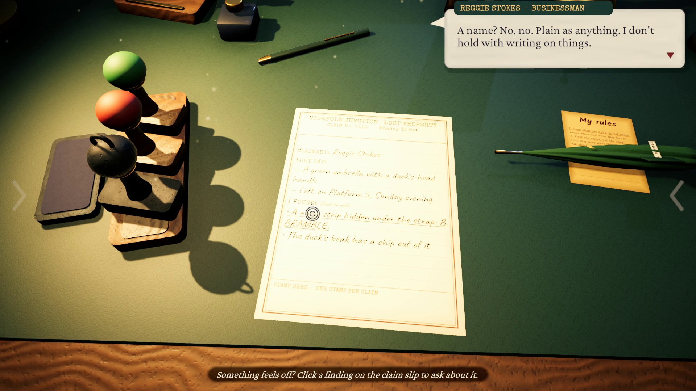 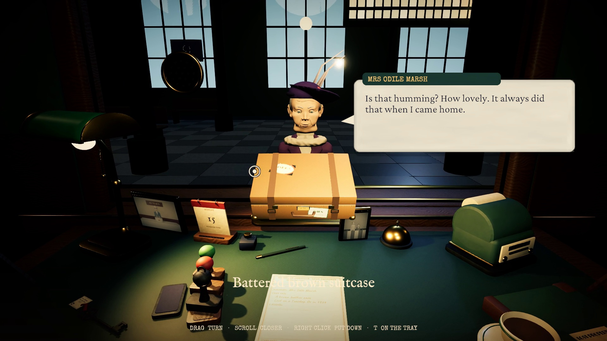

Click a finding on the slip to ask about it with a neutral question. Everything said in the claim (their story, your questions, their answers) is written on a card beside the slip whenever you read it, so you can compare an answer with a finding without asking again. Honest owners answer correctly; liars know only what they could see from across the counter, so they bluff. The game never says "contradiction": you compare, and the evening ledger tells you whether you were right. Some objects **hum** when their owner is at the window, which overrules even a muddled story, like 94-year-old Mrs Marsh's description of a suitcase she lost in 1934.

### Stamp it, and know what the stamp will do

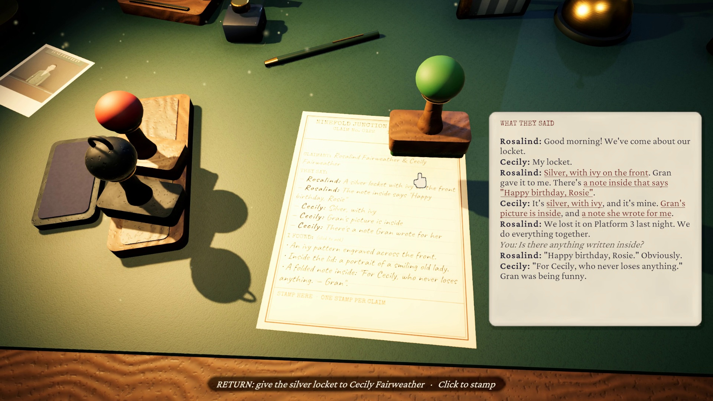 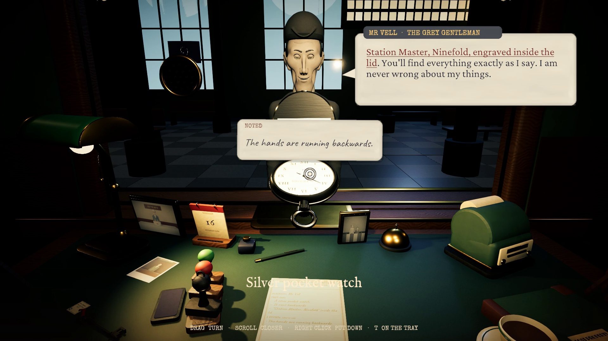

A stamp can't be taken back, so while you hold one over the slip the hint says what it will do there (*RETURN: give the silver locket to Cecily Fairweather*). When two people claim one thing, the half of the slip you stamp decides who gets it.

### The uncanny, gently

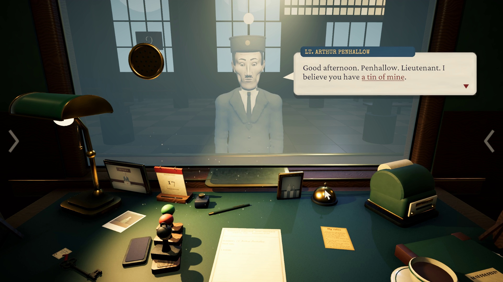 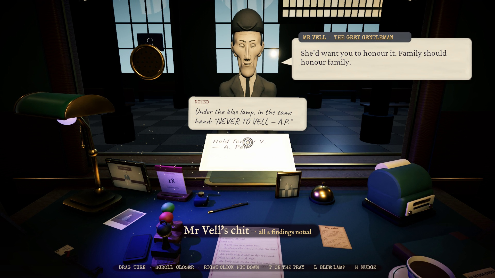

Things come in from other times on Platform 9. A pocket watch found *tomorrow* runs backwards, and a photograph is developed on a date that hasn't happened yet: anything from tomorrow goes in the **Iron Drawer**, even if its owner is standing in front of you. When a cold visitor comes to the window, the glass frosts over. **Mr Vell**, the Grey Gentleman, knows every detail of every object, and nothing ever hums for him. From Thursday, **Agnes's blue lamp** shows what ink tries to hide: hidden dates, forged signatures, and a note she left about Mr Vell. And on Thursday there's a ring in a velvet box. Return it to the right person and **every photograph on your desk changes**.

### Help at hand

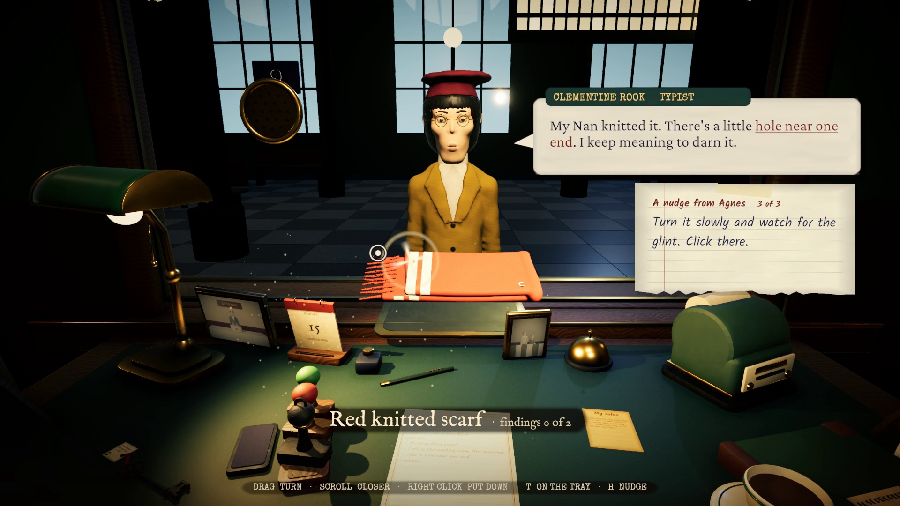 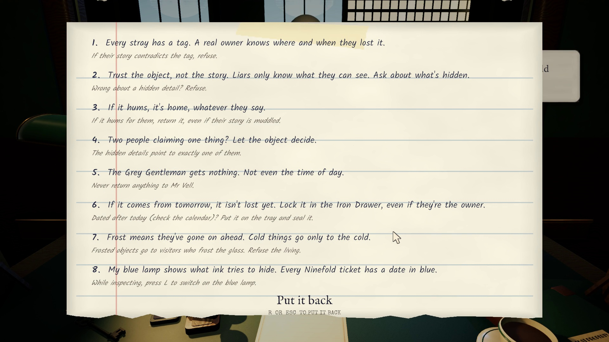

- **Agnes's nudges.** Press `H` during a claim for a nudge, pinned at the right of the screen. It blocks nothing, and each press goes a step further for wherever you've got to (finding the object, examining it, asking, deciding). The last nudge of each step shows you: the drawer or the object lights up, or a glint marks the hidden detail once a click there would find it. Nudges only cite rules you've been given, never quote a finding you haven't found, and never say which stamp to use. After 90 seconds on a claim without progress the hint bar offers one (turn that off in Settings). Every nudge on the best path through the week is in [docs/nudges.md](docs/nudges.md) (spoilers).
- **Agnes's rules** arrive through the week as notes in her hand. The ones you've been given are on her card beside the claim slip: hover it, or press `R` at any time, even with something in your hands.
- **The week so far.** The ledger book on the desk keeps every evening's Day Ledger page as it was that evening, Gazette included (click it, or *The week so far* in the pause menu).

### Choices that carry through the week

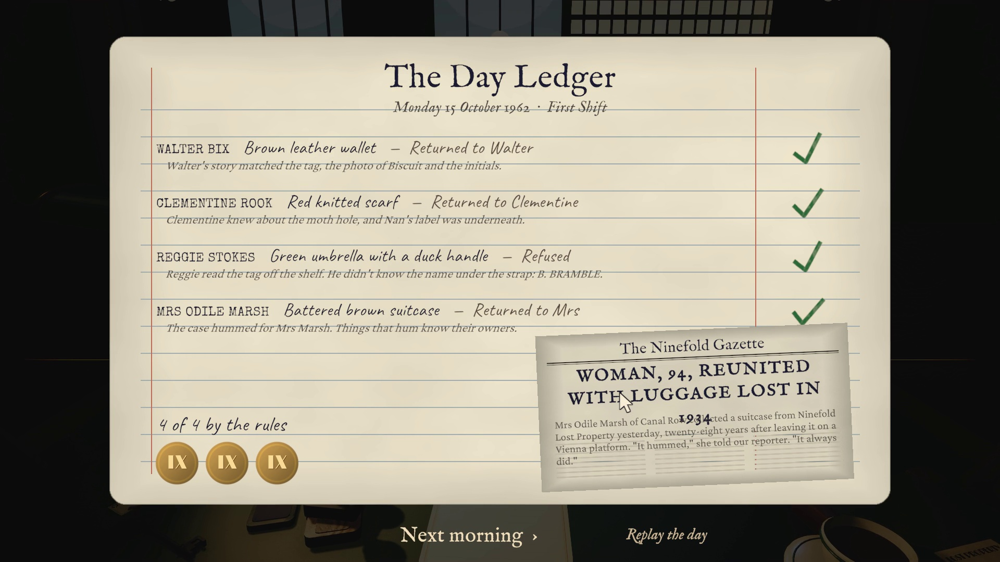 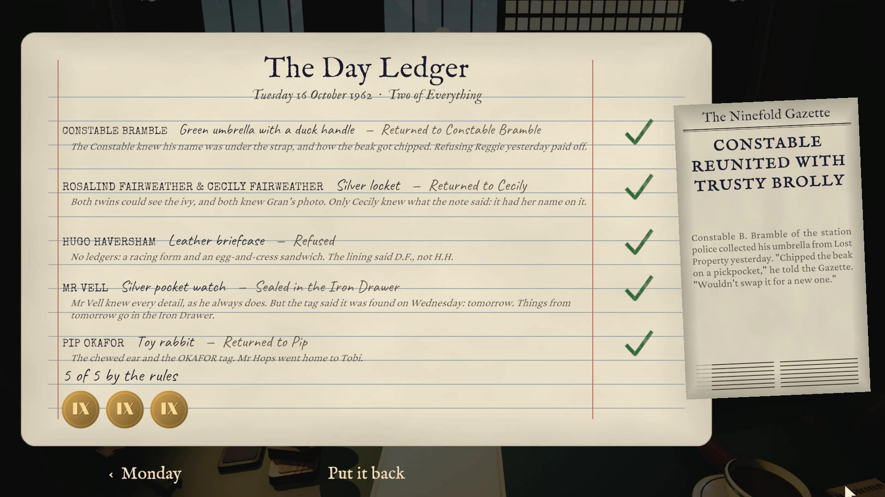

Every evening the **Day Ledger** marks each case against the rules and explains why, and the **Ninefold Gazette** reports what your choices did. Items you refuse stay in storage for their real owner later in the week. Whatever you give the Grey Gentleman makes him stronger, and the station visibly loses its colour. After Friday's ending, a last page sums up the week: each day's tally, your findings and curiosities, and how many of the three endings you've reached. Days can be replayed from the title screen. There are 25 optional curios (one secret per object), and the title's **Curiosities** page shows which you've found and when the rest turn up. *Continue* picks up where you left off, mid-day included.

### Settings, accessibility and the picture

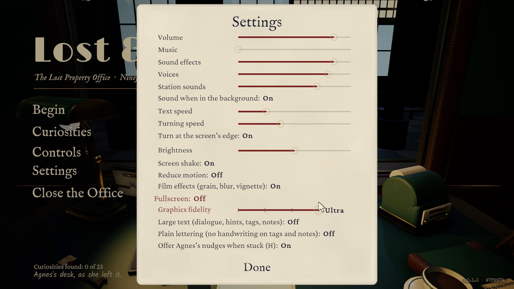 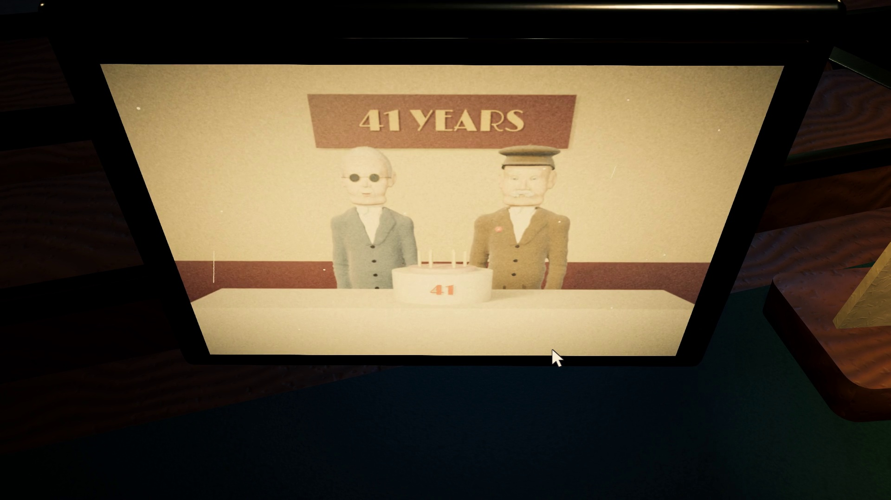

- **Graphics fidelity** in four steps, applied at once:

  | Step | What it does |
  |---|---|
  | **Low** | Render scale 0.7, 512 shadow maps with low softness, FXAA; no ambient occlusion, depth of field, reflections or dust. The fastest. |
  | **Medium** | Render scale 0.85, 1024 shadow maps, SMAA, ambient occlusion at half resolution, depth of field, a small reflection probe, a little dust in the lamp's light. |
  | **High** (default) | The desk as designed: full resolution, 2048 shadow maps, SMAA High, full ambient occlusion, depth of field; brass and glass reflect the room and dust drifts in the lamp's light. |
  | **Ultra** | 1.25× supersampling with 4× MSAA under SMAA High, 4096 shadow maps with four cascades, finer ambient occlusion (12 samples), high-quality depth of field, 16× anisotropic filtering everywhere, a 64-bit colour buffer for smoother gradients in the dark, a sharper reflection probe and more dust. For a strong graphics card. |

  Each step at the same moment: [docs/media/improvements/round12/fidelity_window_low_medium_high_ultra.jpg](docs/media/improvements/round12/fidelity_window_low_medium_high_ultra.jpg).
- **Reading:** *Large text* (dialogue, hints, tags and notes 25% bigger), *Plain lettering* (a clear book face instead of handwriting on the tags, the slip and Agnes's notes, rules and nudges), *Text speed*, and *Brightness* (lifts or lowers the scene without touching the paper and text).
- **Motion and comfort:** *Reduce motion* (cards open at once, and the camera's sway and the held object's bob are stilled or lessened), *Screen shake*, *Film effects* (grain, blur, vignette), *Turning speed*, and *Turn at the screen's edge*.
- **Sound:** volume, music, sound effects, voices and station sounds, and *Sound when in the background*. While another window has the focus the game draws only 10 frames a second.
- **Window:** opens at 1600×900, or the largest 16:9 window that fits a smaller screen; any shape works (a narrower window sees the whole desk, with more above and below); *Fullscreen* fills the screen.
- **Input:** mouse (or touchpad) and keyboard; or a gamepad. Every menu works from the arrow keys or the d-pad with a visible focus, and `Esc` closes cards. There's no touch support.

## Screenshots

| | |
|---|---|
| 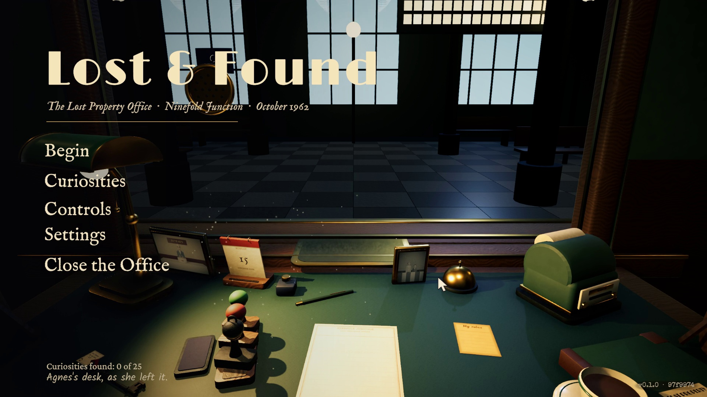 |  |
|  |  |
|  |  |
|  |  |
|  |  |
|  |  |
|  |  |
|  | |

All are frames of the trailer's takes at *Graphics fidelity: Ultra*, 1920×1080.

## Play it

1. Download `LostAndFound-v0.1.0-linux-x86_64.zip` from the [latest release](https://github.com/nearbycoder/LostAndFound/releases/latest). **It's the 4 October build**, older than this README (see [Which version is this?](#about)); [build from source](#build-from-source) for today's game.
2. Unzip it and run `LostAndFound.x86_64` (`chmod +x LostAndFound.x86_64` first if your unzip tool dropped the permission).
3. On a Wayland desktop, if the window doesn't appear, run it with `SDL_VIDEODRIVER=wayland ./LostAndFound.x86_64`.

### System requirements

| | |
|---|---|
| **OS** | 64-bit Linux (x86_64). Made and tested on CachyOS (Arch) with KDE Plasma on Wayland. There's no macOS or Windows download (see below). |
| **Graphics** | A Vulkan GPU. The only GPU it has run on is an AMD Radeon 8060S (integrated). There, at 1600×900, a frame took about 2.6–2.8 ms on Low, 3.0–4.2 on Medium, 4.4–4.7 on High and 10.4–11.8 on Ultra (round 12's bench, with other work sharing the GPU); the game caps itself at 120 fps with vSync. Discrete GPUs and 4K screens are untested. |
| **Memory** | About 0.4–0.55 GB resident while playing (the soak test's figures, rounds 7 and 12). |
| **Disk** | 223 MB unpacked (a build of today's `main`); the v0.1.0 zip is 137 MB. |
| **Input** | Mouse or touchpad and keyboard; or an Xbox-style gamepad (driven only by a virtual gamepad in tests, see [known issues](#status-and-known-issues)). |

Saves and settings live in `~/.config/unity3d/Nearby/Lost & Found/` (`lostandfound_save.json` and `settings.json`; v0.1.0 kept its settings in Unity's `prefs` file in the same folder, and they're brought over the first time a newer build starts). Each save swaps in whole and keeps the one before as `lostandfound_save.json.bak`, so a crash mid-save can't lose the week. A save that can't be read is set aside as `.damaged` (never deleted), and the title says so.

**Reporting a problem:** the title's bottom-right corner says which build you're playing, as `v0.1.0 · 97f9974`: the version and the commit it was built from (a `+` after it means the build had changes that weren't committed; builds of `main` still say v0.1.0, as no newer version has been numbered). Put that in a bug report, with what you were doing (the day and the claimant) and the player log: on Linux `~/.config/unity3d/Nearby/Lost & Found/Player.log` (the run before is `Player-prev.log`), and on a Mac, where it hasn't been tried, Unity writes it to `~/Library/Logs/Nearby/Lost and Found/Player.log`. The log's first lines name the build too. If the save is involved, `lostandfound_save.json` from the Linux folder above helps.

**macOS and Windows:** there's no download for either yet. A universal (Intel and Apple silicon) macOS app can be built from source with `Tools/unity.sh build-mac`, but it **hasn't been run on a Mac**. It isn't signed or notarised, so macOS will refuse to open it until you right-click it and choose *Open* (or run `xattr -dr com.apple.quarantine "LostAndFound.app"`). On a Mac the app is called "Lost and Found". The Windows build is wired up (`Tools/unity.sh build-windows`) but needs Unity's Windows Build Support module, which the machine this was made on doesn't have, so it has never been built.

## How to play

**A case, start to finish:** ring the bell. The claimant describes what they lost, and their key claims are written onto the claim slip. Read the intake tag in the drawer or on the shelf (where it was found, when, on which train). Pick the object up, turn it over, open it, and click anything that glints. Each finding goes on the slip, and clicking a finding asks the claimant about it. An honest owner knows what's inside. A liar only knows what they could have seen. Put the object on the tray and stamp the slip.

| Action | Control |
|---|---|
| Point, pick up, open, press | Mouse (left click) |
| Turn to the drawers / the shelf | `A` / `D`, `←` / `→`, or rest the mouse at the side of the screen (*Turn at the screen's edge* in Settings turns that off; a pointer leaving a window by its side doesn't count) |
| Turn an object over | Drag with the left button (or `Q` `E` `W` `S`) |
| Look closer | Scroll wheel |
| Put the object down / on the counter tray | Right click, `Esc` or `Backspace` / `T` |
| Read the slip and what they said | Hover it, or `Tab` |
| Ask about a finding | Click it on the slip |
| Agnes's blue lamp (from Thursday) | `L` while holding something |
| Ring for the next claimant / advance dialogue | Click the bell or `Space` / click or `Enter` |
| Read Agnes's rules | Hover her card beside the claim slip, or `R` at any time (`R` or `Esc` puts them back) |
| Stuck? A nudge from Agnes | `H` during a claim (press again for a stronger one) |
| Look back at earlier days' Day Ledger pages | Click the ledger book on the desk (bottom right), or *The week so far* in the pause menu; `←` `→` turn the pages |
| Pause: Agnes's rules, the controls, settings, restart the day | `Esc` (`Esc` again to carry on) |
| Menus (the title, the pause menu, Settings and every card) | The mouse, or `↑` `↓` to move between buttons and sliders, `Enter` or `Space` to press, `←` `→` to move a slider, `Esc` to close |

**With a gamepad** (Xbox-style layout; tested only with a virtual Input System gamepad, as no physical controller was to hand):

| Action | Button |
|---|---|
| Move the cursor (it slows over anything you can click) | Left stick |
| Click: pick up, open, note a detail, stamp, menus | A |
| Put the object down / the stamp back | B |
| On the counter tray | X |
| Agnes's rules | Y |
| Turn to the drawers / the shelf | LB / RB |
| Turn a held object · lean in or out | Right stick · RT / LT |
| Ring for the next claimant / move the dialogue on | D-pad down |
| Agnes's blue lamp | D-pad up |
| A nudge from Agnes | D-pad left |
| Earlier days' ledger pages · turn them | A on the desk's ledger, or Menu › *The week so far* · LB / RB |
| Read the slip and what they said · pause | View · Menu |
| Menus: move between buttons and sliders · press · move a slider | D-pad up and down · A · d-pad left and right (the cursor follows) |

Pick up the mouse and it takes over again at once. Both tables are in the game too: **Controls** in the pause menu and on the title shows the one for whatever you're holding. Quick taps count: a touchpad's tap-to-click, or a click on a slow frame, is never lost.

### Agnes's rules

1. Every stray has a tag. A real owner knows where and when they lost it.
2. Trust the object, not the story. Liars only know what they can see. Ask about what's hidden.
3. If it hums, it's home, whatever they say.
4. Two people claiming one thing? Let the object decide.
5. The Grey Gentleman gets nothing. Not even the time of day.
6. If it comes from tomorrow, it isn't lost yet. Lock it in the Iron Drawer, even if they're the owner.
7. Frost means they've gone on ahead. Cold things go only to the cold.
8. My blue lamp shows what ink tries to hide.

## Content

- **5 days**, each with its own title, morning and evening (Friday's evening is the ending):
  - **Monday, First Shift:** a guided first case, the first liar, and a suitcase that hums for a woman who lost it in 1934.
  - **Tuesday, Two of Everything:** twins and a locket, a briefcase that isn't Hugo's, and Mr Vell's first visit.
  - **Wednesday, Tomorrow's Photograph:** a photo dated Thursday, a frosted tin of letters from 1917, and a young man in a 1921 suit.
  - **Thursday, The Ring:** the blue lamp, a forged chit, a humming violin, a record from next year, and the ring.
  - **Friday, The Last Train:** everything at once, and Mr Vell's final requisition.
- **24 cases plus an alternate** that appears depending on Thursday's choice, and short "it isn't here any more" vignettes when an earlier decision took something away.
- **25 objects** (plus three documents claimants bring), each with moving parts, two to four case details, and one optional secret.
- **25 sculpted characters**, from Gus the porter to a WWI lieutenant, with per-character synthesised voices.
- **3 endings:** *The 9:40*, *The Long Wait* and *Grey Ninefold*, each with epilogue lines that react to the week's choices.

## Status and known issues

v0.1.0 (4 October 2026) is the complete first version: all five days, 25 cases, three endings, menus, settings, save and replay. Since then twelve rounds of improvements have landed on `main` but haven't been released: fairness fixes (two cases' evidence couldn't be reached), Agnes's nudges, the transcript beside the slip, the stamp hint, the rules card and the ledger book, the Curiosities page and the week's summary, gamepad play and keyboard menus, a crash-safe save, accessibility settings, windows of any size and shape, *Graphics fidelity*, reflections and dust in the lamp's light, and cards that open and close. Each round's plan, results and evidence are in [docs/IMPROVEMENTS.md](docs/IMPROVEMENTS.md).

The game has been played end to end by its AutoPilot (all four policies, every round), through simulated mouse and keyboard (the trailer's takes), and through the compositor's own pointer and keyboard; **it has not had broad human playtesting yet.**

Known gaps and rough edges:
- **The download is old.** The v0.1.0 release predates every round above, and builds of `main` still call themselves v0.1.0. Numbering and releasing a new version is the owner's call.
- Only Linux has a release. The macOS build is untested on a Mac and unsigned; Windows needs a Unity module that isn't installed here. The browser build ([above](#play-in-your-browser)) has only been checked in headless Chromium and Firefox on Linux.
- Gamepad support has only been driven by a virtual Input System gamepad; no physical controller (or Steam Deck) has been tried. There's no touch support or localisation.
- **Graphics fidelity has only been timed on this machine's integrated GPU while other work shared it**; Ultra on a discrete GPU or a 4K screen is unmeasured. The reflection probe is pictured once per desk, before anyone's at the window, so the claimant and the blue lamp don't show in the brass.
- How easy the hidden details are for a person to find hasn't been tested with people. The audit only proves each can be brought into view; the hardest (the date on the ring's ticket, under the blue lamp) is clickable from about 14% of orientations.
- **Keyboard layouts.** Shortcuts are read by where the key sits on a US keyboard, and the prompts name the US letters. On AZERTY, `A`/`D` (turn) are the keys printed **Q**/**D**, and `Q`/`W` (turn the object) are printed **A**/**Z**. The arrow keys, the screen edges and dragging do the same jobs.
- **The pointer at a window's side.** The game isn't told when the pointer leaves its window, so it judges from the pointer's last step. A pointer stopped on the window's very last pixel, or pushed slowly against the side of the screen in a maximised window, doesn't turn the desk; pull back a pixel, use `A`/`D` or the arrows, or play fullscreen.
- The ledger book sits in the bottom-right corner of the counter view, partly out of frame at 16:9; a player may not notice it. Gus mentions it on Tuesday morning, and the pause menu has *The week so far*.
- A window narrower than 16:9 shows the whole desk smaller (at half a 1080p screen, about 60% of its size in a 1600×900 window). A 16:9 window or *Fullscreen* shows it best.
- Two weeks played back to back in one process keep the same live objects, but resident memory rose about 43 MB between them; it looks like the allocator rather than a leak, but it isn't proven.
- Starting *A New Week* clears the curiosities you've found (the endings you've reached are kept).
- Characters are modelled from the waist up and animated procedurally, with no rigs. The synthesised music and voices are charming but not studio quality.

## Build from source

**You need:** Unity **6000.6.2f1** (URP 17.6, Input System 1.20); Blender **4.5 LTS** on `PATH` as `blender` (only to regenerate models and photographs); Python 3.11 for the texture and audio generators; and `ffmpeg` for the recording tools.

```sh
# Python tools. Use 3.11, the same version as Blender 4.5's Python: the Blender
# scripts import scikit-image from this venv (needs numpy, e.g. from the system).
python3.11 -m venv --system-site-packages .venv
.venv/bin/pip install pillow scipy scikit-image==0.24.0

# open the project in the editor, or build a player headless (each build also validates all content)
Tools/unity.sh                 # GUI editor
Tools/unity.sh build-linux     # -> Builds/Linux/LostAndFound.x86_64
Tools/unity.sh build-mac       # -> Builds/macOS/LostAndFound.app (universal, unsigned; untested on a Mac)
Tools/unity.sh build-windows   # -> Builds/Windows/LostAndFound.exe (needs Windows Build Support installed)
Tools/unity.sh build-webgl     # -> Builds/WebGL/
Tools/build-pages.sh           # the browser build laid out as the GitHub Pages site in Builds/Pages/ (gitignored)
node Tools/check-pages.mjs --serve Builds/Pages --full   # ...checked as Pages will serve it, in headless Chromium
python3 Tools/package_release.py   # zip whatever's built into dist/LostAndFound-v<version>-<platform>.zip
```

`Tools/unity.sh` assumes the editor is at `~/Unity/Hub/Editor/6000.6.2f1/Editor/Unity` (set `UNITY=` to override). Unity 6000.6 links against `libxml2.so.2`; on distros that only ship `libxml2.so.16`, put a copy of the legacy library in `.unity-libs/` and the script will add it to the loader path.

All generated assets are committed, so you only need to regenerate them if you change a generator:

| What | Command |
|---|---|
| Booth and concourse | `blender -b -P ArtSource/build_booth.py` |
| Desk props | `blender -b -P ArtSource/build_props.py` |
| The objects (add `-- --only id1,id2 --preview /tmp/p` to render previews) | `blender -b -P ArtSource/build_objects.py` |
| The commuters | `blender -b -P ArtSource/build_people.py` |
| Photographs (raw renders, then ageing) | `blender -b -P ArtSource/render_photos.py`, then `.venv/bin/python Tools/textures/finish_photos.py` |
| Material, UI and item textures | `.venv/bin/python Tools/textures/gen_textures.py` and `gen_item_textures.py` |
| The app icon | `.venv/bin/python Tools/textures/gen_icon.py` |
| Sound effects, voices, ambience; music | `.venv/bin/python Tools/audio/gen_sfx.py`; `gen_music.py` |

### Validation and automated play

| Check | Command | What it proves |
|---|---|---|
| **Unit tests** | `Tools/unity.sh test` (results in `Logs/test-results.xml`) | 136 EditMode tests over the real content, no player needed: the validator, the solver deriving every case's best verdict, all three endings from whole weeks played in memory (the AutoPilot's three policies), Thursday's choice swapping Friday's case, scoring, when each rule arrives, story-flag expressions, every detail having a hotspot or a part that reveals it, short names, the save file's round trip (including mid-day progress, endings reached, and old saves) and its crash safety (a truncated, empty or garbage save, a failed write), strays only leaving after their last case, the Curiosities count, and Agnes's nudges (every claim of the `best` and `worst` weeks followed nudge by nudge to a decision, with keyboard and gamepad wording: only rules already handed over, no unfound finding quoted, no stamp named, and the decision nudge agreeing with the solver), the transcript beside the slip (every speaker named, two claimants never sharing a name), the settings file (round trip, a damaged file giving the defaults), which menu choices ask before undoing claims, the size of the window on a small screen, the ledger book's pages (only days already closed, each drawn from the state its own evening left, a replay dropping the days after it), the camera keeping the 16:9 view's width on a narrower window, what the hint says a stamp will do over each half of the slip, when a pointer has left the window by its side, and the graphics fidelity steps (four, High as designed, each at least as costly as the one below, an old saved Picture quality reading the same). |
| **Content validator** | runs in every `build-linux`, or `Tools/unity.sh run LostAndFound.EditorTools.BuildScript.ValidateContent` | The rules solver, using only what's discoverable at the desk, derives each case's authored best verdict. Current result: 28 objects, 5 days, 25 cases, 0 issues. |
| **AutoPilot** | `Tools/unity.sh autopilot [speed] [startDay] [best\|worst\|wait\|refuse]` | The built player plays the whole week through the real desk systems, with a screenshot of every case (plus each day's rules card and first tag). `best` gets 24/24 and *The 9:40*; `worst` gives Vell everything and reaches *Grey Ninefold*; `wait` refuses Thomas the ring and reaches *The Long Wait*; `refuse` refuses everything (the fullest the shelves get, and Gus's basement trips). With the player's `-lafQuitAfter <case>` and then `-lafContinue`, it checks that *Continue* resumes mid-day. Add `-lafTranscript` to ask about every finding and check that the card beside the slip holds every line said, on screen and clear of the slip; `-lafTextAudit` to check every text on screen against its box, and against the other texts on the same card or panel, at each screenshot, and that no reading panel (the speech bubble, Agnes's notes, the tag, the nudge, the card beside the slip, the rules peek) is drawn over another's letters and the speech bubble isn't over anyone's face; `-lafFaceWatch` to make that last check at the end of every frame rather than at screenshots (`[FaceWatch]`); `-lafPlainLettering` or `-lafTextSize 1` (or `-lafBrightness -1..1`) for one run in those settings. Before each verdict it holds the stamp over the slip with a virtual mouse (over both halves when two people claim) and checks the hint names the verdict, the item and the claimant (`[StampHint]`). Each morning it opens the ledger book on the desk, photographs every page and logs it as `[LedgerBook]`, to compare with that evening's `[Ledger]` line, and on the first morning checks the game's own picking can reach the book. `-lafHitches` logs every frame over 100 ms with what was happening, and `-lafNoShots` leaves out the screenshots (which stall a frame themselves) while it does. `LAF_AUTOPILOT_SAVE=<path>` lets several runs share one save (the week summary's endings count). Results are in `Logs/autopilot.log`. |
| **Gamepad test** | `Tools/unity.sh padtest` | Plays Monday's first case with only a virtual Input System gamepad (cursor, right stick, buttons, and the d-pad's left for two nudges in pad wording), counts any keyboard or mouse events during play (there should be none), then checks that moving a mouse takes control back. |
| **Tap test** | `Tools/unity.sh taptest [w] [h] [player args]` | Plays Monday's first case with quick taps: each press and its release reach the game in the same input update, as a touchpad's tap-to-click does. Keys ring the bell, ask for a nudge, turn, use the tray and pause. Mouse taps open a drawer, pick up the wallet and work the pause menu and the Controls card. Pad taps take control, ask for a nudge, stamp the slip and put the card away. Before round 4's fix, 1 of 11 such taps worked. |
| **Soak** | `Tools/unity.sh soak [cycles]` | Plays on without quitting, as someone who leaves the game open all evening does: in one process it goes round the menus' own buttons again and again (decide a claim, *Start the day again*, *Back to the title*, *Continue*, *Choose a Day*), each of which tears the game down and builds it again. After every cycle it logs memory and the live materials, meshes, textures and objects, and passes only if the last ten cycles hold steady and every choice that would lose progress asked for a second click (and only those). At the end it finishes a day and checks the Day Ledger's *Replay the day* the same way. `LAF_SOAK_SAVE=<path>` starts it from an existing save, such as a finished week. AutoPilot `-lafWeeks 2` plays two whole weeks back to back in one process. Log in `Logs/soak.log`. |
| **Nudge tour** | `Tools/unity.sh nudgetour [speed] [w] [h] [player args]` | The AutoPilot plays the week as a stuck player: at every stage of every claim it asks for every nudge, then does what they say. It picks up what glows, works the part that lights up, turns the object until the glint appears and clicks on the glint, and asks what it's told to ask. It checks the glint only shows where a click finds the detail, and that the hint bar offers a nudge after 90 s idle. Log in `Logs/nudgetour.log`. |
| **Hotspot audit** | `Tools/unity.sh audit` (table in `Screenshots/hotspots/coverage.txt`) | Holds every object as the inspect view does, lids shut and open, through 1,500 orientations at two zooms, and asks the game's own picking code whether each hidden detail could be clicked. Then, for every day with nothing yet returned (the fullest storage gets), it checks that every stored object has a real slot and can be hovered from its shelf or open drawer. Fails if any detail or object falls under 10%, and saves a picture of each detail that does. |
| **The browser build, as Pages serves it** | `Tools/build-pages.sh`, then `node Tools/check-pages.mjs --serve Builds/Pages --full` (add `--browser firefox`), or `node Tools/check-pages.mjs https://nearbycoder.github.io/LostAndFound/` for the live site | Serves the site at `/LostAndFound/` with no compression headers, as GitHub Pages does, and plays it in a fresh headless browser with no npm packages (Chromium by its DevTools protocol, Firefox by WebDriver BiDi). It passes only if the game reaches its title with no console error, failed download or exception. `--full` goes on to the menus by keyboard, the browser's fullscreen, the fidelity setting surviving a reload, sound starting after the first key, a short session with keys and the mouse, and the AutoPilot's save picked up after a reload. Console, `report.json` and screenshots in `Logs/check-pages/<browser>/`. |
| **WebGL in Chrome** | `python3 Tools/serve_webgl.py Builds/WebGL &` then `python3 Tools/webgl_check.py --url 'http://127.0.0.1:8764/?lafSmoke=smoke' --out Logs/webgl/smoke --profile Logs/webgl/profile` | Plays the WebGL build in Chrome on the real GPU (headless, ANGLE on EGL), records the console, screenshots every `[Shot]` the game logs, and lists what the page keeps in IndexedDB. In a browser the game reads its `-laf…` options from the query string (and `?lafShot` makes the page itself log screenshots of its loading and error states), so the smoke test and AutoPilot run there too (`?lafAutopilot=x&lafQuitAfter=1.2`, then `?lafAutopilot=x&lafContinue` with the same `--profile` to check the save survived). |
| **Smoke test** | `Tools/unity.sh smoke 30 [quality]` | Frame rate (uncapped) and errors over a hands-free run; `quality` 0 to 3 (Low to Ultra) overrides the graphics fidelity for that run only. With `-lafShowSettings` or `-lafShowControls` it opens that card over the title, and `-lafTextAudit` audits its texts; `-lafCardFrames` photographs Settings and the pause menu as they open and close, with *Reduce motion* off and on. |
| **Fidelity bench** | `Tools/unity.sh fidelity [w] [h] [moments]` | Plays Monday's first claim and, at each named AutoPilot moment (by default the claimant at the window and the wallet in your hands), holds the game still and times every Graphics fidelity step over 400 uncapped frames, Low to Ultra and back (each step's figure is the mean of its two medians), photographing each step at the same moment. `[Fidelity]` lines with the load average in `Logs/fidelity.log`, pictures in `Screenshots/fidelity/`. `-lafUltraWithout msaa,hdr,dof,ao,shadows,cascades` leaves parts of Ultra out, to see what each costs and adds. |
| **Menu test** | `Tools/unity.sh menutest [w] [h] [player args]` | The menus with only a virtual keyboard, then only a virtual gamepad: from the title's first item to Settings, the fidelity to Ultra (checked applied and saved) and back, `Esc`, Begin, the pause menu and its Controls card; then the pad's Menu, its d-pad and A through the same. Every step checked. Log in `Logs/menutest.log`. |
| **Pointer test** | `Tools/unity.sh pointertest [w] [h]` | The real pointer at the window's sides: KWin's own pointer, moved through its fake-input protocol (`Tools/fakeptr.c`, which only connects to this script's private KWins), so the game hears enter, motion and leave as it would from a mouse. It rests just inside each side (the desk turns), leaves by each side briskly, at an ordinary pace and slowly and stays out (it mustn't), comes back in, and, with the window snapped against the screen's side, is flung against it (it turns). Log in `Logs/pointertest.log`. |
| **Real-input play** | `Tools/unity.sh realplay [until day] [w] [h]` | The filmed play's whole days (from the title, by default to Tuesday morning; `5` plays the week to the ending), with real input: the play's pointer moves, clicks, drags and key presses go to KWin's own pointer and keyboard, and the game reads them through SDL as it would a mouse and keyboard. On the first claim it also presses `H`, `Tab` and `Esc`, brings the object closer and back with the wheel, and puts it down with a right click. Passes with no fallbacks (nothing the play had to do directly because the input didn't) and every claim decided as the play meant. Nothing is recorded. Log in `Logs/realplay.log`. |
| **Edge test** | `Tools/unity.sh edgetest [w] [h]` | Holds a virtual mouse at each side of the screen on Tuesday at the bell (slowing to a stop there, as a person does): the desk turns with *Turn at the screen's edge* on, doesn't with it off, and doesn't while another window has the focus (the headless KWin opens one once the test says it's ready), then turns again when the focus comes back. Log in `Logs/edgetest.log`. |
| **Settings upgrade probe** | `Tools/prefs_probe.sh` (after `build-linux`) | Writes settings the way v0.1.0 did (PlayerPrefs, saved at once) in a scratch config folder, shows which file they land in, and starts this version on them to check they're brought over into `settings.json`. Also shows that `~/.config/unity3d/unknown/unknown/` is never read or written. |
| **Small screens** | `Tools/unity.sh smallscreen <w> <h> [scale] [player args]` | A first launch on a screen of that size (a short smoke run), in a headless KWin of its own: its own D-Bus session and scratch folders, so nothing shows on the desktop and the real session's settings aren't touched. KWin reports where it put the window, and `spectacle` photographs the whole screen. `scale 2` is a HiDPI screen at 200%. `LAF_STEAL="10 20"` puts another window over the game for a while (with `-lafBackgroundTest`, to see it go quiet behind it), and `LAF_SETTINGS` starts from given settings. Needs `kwin_wayland`, `kscreen-doctor`, `spectacle` and `kdialog` (KDE Plasma). Results in `Screenshots/smallscreen/`. |
| **Filmed play** | `Tools/unity.sh film <name> [-lafDay N] [-lafUntil N] [-lafShowcase]` | Plays whole days through a simulated mouse and keyboard, the same input path a player uses, and records them. It turns each object until a hidden detail faces it and clicks it. The log ends with how many details were found by hand and how many needed the recorder's fallback, which should be none. `-lafShowcase` also works the menus from the keys, asks for nudges, reads the rules and the ledger book (for the trailer); `LAF_SETTINGS='<settings.json>'` films with those settings. |

Every player run above keeps its prefs in `Logs/config/<command>/` rather than your real `~/.config/unity3d/Nearby/Lost & Found/`. Each one also runs inside a headless KWin of its own (as `smallscreen` does: its own D-Bus session, socket and scratch folders), so no test window ever opens on your desktop; `LAF_DESKTOP=1` runs it as an ordinary window instead. The script points `XDG_CONFIG_HOME` there and passes `-lafSave` for the save. Batch editor runs (builds, `test`, `run`) get `Logs/config/editor/`, which links back to the real config folder for everything except this game's own, so the editor still finds its licence. The interactive editor (`Tools/unity.sh` with no command, or `headless`) gets the same folder, so pressing Play in the editor uses a scratch save and settings too. Every one of these runs checks the real folder's hashes and timestamps before and after, and fails (`[guard] … CHANGED`) if anything in it changed, so testing can't overwrite your own save or settings.

### The trailer and README media

```sh
S='{"values":[{"key":"quality","value":3.0}]}'   # Graphics fidelity: Ultra, as a player would set it
LAF_SETTINGS=$S Tools/unity.sh film p_day1 -lafUntil 1 -lafShowcase    # the title, then Monday
LAF_SETTINGS=$S Tools/unity.sh film p_day2 -lafDay 2 -lafShowcase      # ...one take per day, through p_day5
LAF_SETTINGS=$S Tools/unity.sh film p_grey -lafDay 4 -lafUntil 5 -lafVerdicts 4.2=return:vell,5.5=return:vell -lafShowcase
.venv/bin/python Tools/make_trailer.py --takes p_   # -> docs/media/trailer.mp4, trailer_poster.jpg, screenshots, teaser.webp
```

Takes are frame-locked 30 fps captures without the score, so Ultra films smoothly however slowly the machine renders. `make_trailer.py` cuts every shot relative to event markers the recorder writes, so a re-filmed take keeps its cuts on the same moments. It then lays the game's own music under the shots and ducks it beneath the sound effects and voices. `--takes <prefix>` picks which takes to cut from (the October 4 cut used takes named `day1` … `grey`), and `make_trailer.py stills` or `teaser` makes just those.

## Project structure

```
Assets/Game/Scripts/      C# (one assembly, LostAndFound; editor tools in Assets/Game/Editor)
  Core/                   content model (JSON), story state, the rules solver and validator, save game, nudges
  Desk/                   interaction, camera, drawers, items, inspection, claim slip, stamps, gadgets, props
  Flow/                   Game (bootstrap, restart), Director (days, cases, verdicts, nudges, the photograph sequence)
  People/                 procedural commuter animation
  UI/                     code-built uGUI: dialogue, notes, ledger and ledger book, title, pause, settings, menus, ending
  Audio/, Visuals/, Util/ mixing, materials, fonts, post-processing and graphics fidelity, tweening, input, settings
  Debug/                  SmokeTest, AutoPilot (plays the whole week), DemoRecorder (filmed play), HotspotAudit, the input tests
Assets/Game/Tests/EditMode/  unit tests (NUnit, run with Tools/unity.sh test)
Assets/Game/Icon/         the app icon (generated)
Assets/Game/Resources/
  Content/*.json          every object, commuter, rule, day, case, line of dialogue, gazette and ending
  Models/                 FBX exported from Blender (booth, props, 28 objects, 25 people)
  Textures/, Photos/      generated textures; the rendered and aged photographs
  Audio/, Music/          synthesised WAVs
  Fonts/                  OFL / Apache fonts (licences in docs/licenses)
ArtSource/                Blender build scripts (lib/laf.py helpers, lib/sdf.py sculpting), fonts, booth.blend
Tools/                    unity.sh, texture/photo/audio/icon generators, test helpers, make_trailer.py, package_release.py
docs/                     BRIEF.md (the original brief), PLAN.md (design and technical plan), IMPROVEMENTS.md, nudges.md, licences, media
```

## Tech highlights

- **The scene is empty.** `Boot` builds the whole game at runtime from code and the `Resources` folder: the camera rig, lights, post-processing, desk, props, UI and the director. There's no fragile scene wiring, and restarting a day just tears the game down and builds it again.
- **Content is data.** Objects, details, hotspots, parts, claims, answers, verdicts, story flags, Gazette headlines and endings are all JSON. Model hotspots are named empties (`HS_<detail>`) and animated parts are named nodes (`Lid`, `Flap`, `Key`), so the data and the Blender models line up by name.
- **A rules solver keeps every case fair.** `Rules.Solve` sees only what a player can learn at the desk (the tag, discoverable details, claims and answers, traits, and the rules unlocked by that point) and must derive each case's authored best verdict. The build fails validation if it can't. The same solver drives the AutoPilot, and Agnes's nudges are checked against it.
- **Hidden-detail picking** projects each hotspot to the screen and checks that it faces the camera and isn't occluded by the object itself. A magnifier glints within a radius, so discovery guides you without spoiling anything.
- **Story state and consequences.** Verdicts set flags (`ring=thomas`, `vellItems+=1`, and so on) that move items, swap in alternate cases, rewrite later dialogue, change the photographs (each has a *before* and an *after* render), and drain the post-processing saturation for every gift to the Grey Gentleman.
- **Sculpted, not modelled.** `ArtSource/lib/sdf.py` builds heads, hands, hair and cloth as signed distance fields, then meshes them with marching cubes, so faces, lips and ears are one continuous surface. Characters are split into parts (`Head`, `EyeL`, `BrowR`, `Mouth`, hands) and animated procedurally: breathing, blinking, glances, talking and emotes, with no rigs.
- **Photographs are staged with the real cast.** `render_photos.py` poses the character models in small sets and renders them in Blender, and `finish_photos.py` ages them into 1921 sepia, 1951 silver and 1962 Polaroids.
- **Every sound is synthesised.** `Tools/audio/synth.py` is a small numpy toolkit (oscillators, filters, FM, Karplus-Strong strings, convolution reverb, formant voices). It produces about 170 SFX, voice and ambience clips, and a swing-jazz score built around a nine-note "Ninefold" motif. Voices are per-character formant babble.
- **Frame-locked recording.** `DemoRecorder` locks game time to 30 fps, pipes every frame to ffmpeg through async GPU readback, and captures the mixed audio with `AudioRenderer`, so footage is smooth however slowly the machine renders. Its `-lafPlay` mode drives a simulated mouse and keyboard through whole days, and that's how the trailer was shot.

## Credits

Design, code, models, textures, photographs, sound and music were all made for this project, and are generated by the scripts in this repository. The project was developed with [Claude Code](https://claude.com/claude-code).

**Fonts** (licence texts in [`docs/licenses/`](docs/licenses)):

| Font | Used for | Licence |
|---|---|---|
| [Caveat](https://fonts.google.com/specimen/Caveat) | the clerk's handwriting: tags, the slip | SIL OFL 1.1 |
| [Kalam](https://fonts.google.com/specimen/Kalam) | Agnes's notes | SIL OFL 1.1 |
| [Homemade Apple](https://fonts.google.com/specimen/Homemade+Apple) | signatures on letters and labels | Apache 2.0 |
| [Special Elite](https://fonts.google.com/specimen/Special+Elite) | typewritten forms | Apache 2.0 |
| [Courier Prime](https://fonts.google.com/specimen/Courier+Prime) | printer receipts | SIL OFL 1.1 |
| [IM Fell English](https://fonts.google.com/specimen/IM+Fell+English) | titles, the Gazette, the trailer's captions | SIL OFL 1.1 |
| [Limelight](https://fonts.google.com/specimen/Limelight) | station signage, the title | SIL OFL 1.1 |
| [Crimson Pro](https://fonts.google.com/specimen/Crimson+Pro) | UI body text | SIL OFL 1.1 |
| Liberation Sans (TextMesh Pro's default, licence in `Assets/TextMesh Pro/Fonts/`) | fallback | SIL OFL 1.1 |

**Engine and packages:** Unity 6000.6 with the Universal Render Pipeline, Input System, uGUI and TextMesh Pro, all under the Unity Companion License / Unity terms of service.

**Tools:** Blender 4.5 (GPL; output is unrestricted), Python with NumPy, SciPy, scikit-image and Pillow (BSD/HPND-style licences), and FFmpeg (for recording and the trailer).

## License

No license has been chosen yet, so all rights are reserved by the author for now.
